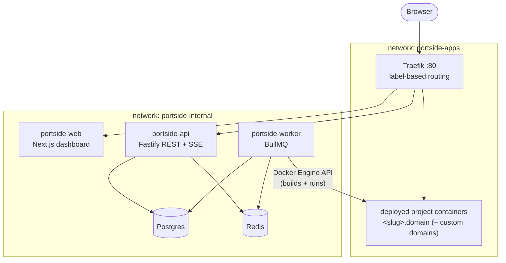

# Portside

A self-hosted, minimal Vercel/Railway: connect a Git repo or upload a zip, Portside detects the
project type, builds it inside an isolated container via the Docker Engine API, deploys it behind
a reverse proxy with a zero-downtime swap, and hands back a live URL — with build logs streamed
to a dashboard in real time.

This is an evolving project. It intentionally does one vertical slice well (static sites, Node.js
apps, and Dockerfile-based apps) rather than supporting every framework for now.


## What it does

- **Connect a repo or upload a zip** — GitHub OAuth for repo access, or drag-and-drop a zip
  (zip-slip and zip-bomb protected extraction).
- **Auto-detects project type** — static site, Node.js app, or a repo with its own Dockerfile —
  and builds it through the Docker Engine API directly, no `docker build` subprocess.
- **Deploys with a real zero-downtime swap** — a redeploy's new container comes up alongside the
  old one under the same hostname; traffic cuts over once it's confirmed healthy (not just
  "started"), and the old container drains for 5s before it's removed. See
  [writeups/dynamic-proxy-routing.md](docs/writeups/dynamic-proxy-routing.md).
- **Streams build logs live** — Redis Streams + SSE, with gap-free resume on a mid-build page
  refresh, and every secret redacted before it ever reaches the stream.
- **Rolls back with no rebuild** — repoints traffic at a previously-built image directly.
- **Routes custom domains** alongside the platform-assigned URL, and redeploys automatically on a
  **GitHub push webhook** (HMAC-verified, filtered to the project's branch).
- **Scans every build with Trivy** and reports findings in the log — visibility, not a gate.
- Full dashboard: project list, deploy history, live/archived logs, env var management
  (encrypted at rest, injected at runtime only, never as a build arg), rollback, delete with full
  container/image cleanup.

## Architecture



User containers sit only on `portside-apps` — they have no network route to Postgres, Redis, or
the API, even though everything runs on one host. Full design detail, including the deploy
lifecycle and the two hardest parts of the system: [docs/ARCHITECTURE.md](docs/ARCHITECTURE.md).

## Stack

- **Frontend:** Next.js 15 + TypeScript + Tailwind, SSE log viewer
- **API:** Fastify (TypeScript), GitHub OAuth, HMAC-verified webhooks
- **Worker:** BullMQ, dockerode against the Docker Engine API
- **Proxy:** Traefik, dynamic Docker-label routing (no config file rewrites), blue/green cutover
- **Data:** PostgreSQL (Prisma), Redis (queue + log streaming via Streams)
- **Security:** AES-256-GCM secrets at rest, per-container resource/capability hardening, network
  tenant isolation, Trivy image scanning

## Getting started

```bash
cp .env.example .env               # fill in PORTSIDE_ENCRYPTION_KEY, SESSION_SECRET, GitHub OAuth
npm install
docker compose --env-file .env -f infra/docker-compose.yml -f infra/docker-compose.dev.yml up --build
```

- Dashboard: http://app.localhost
- API health: http://api.localhost/health
- Traefik dashboard: http://localhost:8080

Full setup, troubleshooting, and a real VPS deployment guide: [docs/RUNBOOK.md](docs/RUNBOOK.md).

## Documentation

| Doc | Contents |
|---|---|
| [docs/ARCHITECTURE.md](docs/ARCHITECTURE.md) | Topology, deploy lifecycle |
| [docs/DATA-MODEL.md](docs/DATA-MODEL.md) | Schema + deployment state machine |
| [docs/SECURITY.md](docs/SECURITY.md) | Threat model, known v1 gaps |
| [docs/API.md](docs/API.md) | REST + SSE reference |
| [docs/RUNBOOK.md](docs/RUNBOOK.md) | Local setup, troubleshooting, VPS deployment |
| [docs/writeups/](docs/writeups/) | Deep-dive technical write-ups |

## Status

The full pipeline works end to end and is exercised against a real running stack, not just
typechecked: connect a repo or upload a zip, watch it build and go live with streamed logs, roll
back with no rebuild, redeploy on a GitHub push, and see traffic move to a new deployment with
zero failed requests along the way. See [docs/SECURITY.md](docs/SECURITY.md) for what's
deliberately out of scope for a single-node, portfolio-scale deployment.
